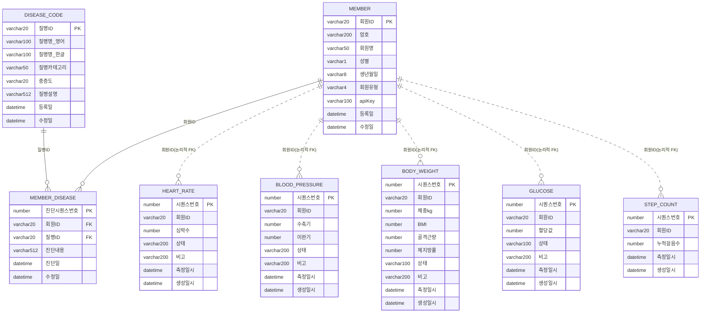

# 데이터 모델 — 외부 데이터 vs 내부 데이터

## 🌐 외부 데이터 (External Data)

> **⚠️ 이 섹션은 우리 시스템이 소유/설계한 데이터 모델이 아닙니다.**
> 아래 내용은 백엔드가 WebSocket으로 수신하는 **외부 시뮬레이터 서버**(`healthsim.iranglab.com`, `/simulator` 네임스페이스)가 자체적으로 생성하여 내려주는 값의 구조와 산출 규칙입니다. `User`, `UserDisease`, `UserBodyRecord`, `baselineHeartRate` 등의 명칭은 **외부 서버 내부 구현**의 용어이며, 우리 백엔드의 DB 스키마와는 무관합니다. 우리 시스템은 이 값을 있는 그대로 수신·저장·표시할 뿐, 생성 로직을 재현하거나 소유하지 않습니다.
> 프로토콜/이벤트 목록은 [health-backend/docs/SIMULATOR_API_SPEC.md](../health-backend/docs/SIMULATOR_API_SPEC.md) 참고. 원본 출처: `health-backend/docs/Health_interface.pdf`

### 공통 규칙 (외부 서버 기준)

- 모든 `timestamp`는 한국시간(KST, UTC+9) 기준, `+09:00` 오프셋의 ISO 8601 문자열
- 회원별 "수면 중" 시간대는 회원 고유 기준 수면시간(`userId` 해시로 6.0~9.0시간 산출, KST 07시 기상 고정)으로 판정되며, 이 판정이 심박수·걸음수·혈압·혈당 값 생성에 공통으로 반영됨

### 1. UserProfile (🌐 외부)

| 필드 | 값 범위 / 산출 규칙 |
| --- | --- |
| weightKg | 외부 서버의 최신 체중 기록 또는 기본값, 없으면 0 |
| bmi | 외부 서버의 최신 BMI 기록 또는 기본값, 없으면 0 |
| hypertension | 외부 서버 내 질환 매핑에 `HYP` 존재 여부 |
| diabetes | 외부 서버 내 질환 매핑에 `DIA` 존재 여부 |
| heartDisease | `MI`(심근경색) > `ARR`(부정맥) 우선순위로 판정, 둘 다 없으면 `null` |
| otherConditions | `HYP`/`DIA`/`MI`/`ARR`/`none`을 제외한 질환 코드 (예: `AST`, `SLP`, `CHO`, `ATH`, `THY`) |

### 2. HeartRate (🌐 외부)

- 기준값: 회원별 고유 기준 심박수(baseline)
- 변동폭: 평상시 ±5bpm, 수면 중 ±2.5bpm
- 부정맥(`ARR`) 보유 시 변동폭 추가: 평상시 ±4bpm, 수면 중 ±2bpm
- 고혈압/당뇨 보유 시 +2bpm 가산
- 수면 중: 기준치의 약 82%로 낮춤, 하한 42bpm (평상시 하한 50bpm)
- **이상 이벤트** (10분 주기, `MI`/`HYP` 보유자만 발생): 기준치(수면 중이면 82% 적용) + 20bpm + (`MI` 보유 시 +10bpm 추가) + 0~10 난수, 하한 100bpm → 이때 `source: "abnormal_event"`, `note: "Possible tachycardia detected."`

### 3. StepCount (🌐 외부)

- 평상시: `max(10, 회원별 기준 걸음 생성률 × 20 + 0~20 난수)` 만큼 매 틱(4.5초) 누적
- 수면 중: 90% 확률로 증가 0, 10% 확률로 1~5보만 증가 (화장실 이동 등 모사)
- 날짜 변경 판정은 KST(UTC+9) 기준 — 자정(KST 00:00)에 `stepCount`가 0으로 초기화되고 그 틱에서 `dailyReset: true`가 1회 표시됨

### 4. BloodPressure (🌐 외부)

- 기준값: 고혈압(`HYP`) 보유 시 수축기 140 / 이완기 90, 미보유 시 120 / 80
- 수면 중: 야간 혈압 하강(nocturnal dipping) 반영 — 기준치에 0.88 곱함, 변동폭도 절반
- 변동폭: 평상시 수축기 ±6 / 이완기 ±4, 수면 중 수축기 ±3 / 이완기 ±2
- 하한: 수축기 90, 이완기 55
- 이벤트 자체에는 "혈압상태" 필드가 없으므로, 정상/이상 여부는 수신 측(백엔드)에서 수축기·이완기 값 기준으로 판정해야 함

### 5. Weight (🌐 외부)

- `weightKg`, `bmi`는 세션 중 고정값(userProfile과 동일)
- 체지방률(`bodyFatPercentage`): Deurenberg 공식 `1.2×BMI + 0.23×나이 − 10.8×성별계수(남 1/여 0) − 5.4` + ±1%p 무작위 변동, 5~50% 범위로 clamp
- 골격근량(`skeletalMuscleMassKg`): `체중 × (1 − 체지방률/100)`으로 구한 제지방량의 42~46%
- 하루 중 최대 3회(08/12/18시)만 전송되므로 수면 시간대와는 겹치지 않음

### 6. Glucose (🌐 외부)

- 공복 기준치: 당뇨(`DIA`) 보유 시 130, 미보유 시 95
- 변동폭: 평상시 당뇨 ±10 / 비당뇨 ±5, 수면 중에는 각각 ±5 / ±3으로 축소
- 식후 스파이크: 수면 중이 아니고 KST 08/12/18시 이후 2시간 이내일 때만 적용 — 비당뇨 +15~30, 당뇨 +40~70
- 새벽 현상(dawn phenomenon): 수면 중이며 당뇨 보유자이고 기상 1.5시간 이내로 남았을 때 +10~25 추가 상승
- 하한: 70
- `status` 판정: 140 이상 `high`, 110~139 `elevated`, 그 미만 `normal`

### 7. Sleep (🌐 외부)

- 기준 수면시간: `userId`를 MD5 해시해 6.0~9.0시간 사이 값으로 고정 부여 (회원마다 다름)
- 나이 보정: 40세 이상 −0.3시간, 60세 이상 −0.6시간
- 매 전송 시 기준치에 ±0.6시간 무작위 변동
- 수면무호흡(`SLP`) 보유 시 0.8~1.8시간 추가 차감, 60% 확률로 품질을 무조건 `poor`로 강제
- 품질 분류(수면무호흡 강제 케이스 제외): 7.5시간↑ `good`, 6~7.5시간 `fair`, 6시간↓ `poor`
- `bedTime`은 `wakeTime`(당일 07:00 KST)에서 `sleepHours`만큼 역산

### 8. Error / Pong (🌐 외부)

- `error`: 값 생성 로직 없음, 인증 실패 시 고정 페이로드(`AUTH_FAILED`)만 전송
- `pong`: 값 생성 로직 없음, 클라이언트가 보낸 `ping` payload를 그대로 echo

---

## 🏠 내부 데이터 (Internal Data)

> 아래 내용은 우리 시스템이 자체적으로 설계·소유하는 DB 스키마입니다. 위 "외부 데이터"(healthsim 시뮬레이터)와는 회원ID를 키로 매핑되며, 실시간 이벤트 수신 시 백엔드가 아래 테이블에 저장합니다.
> 회원관리테이블/질병코드테이블은 `REQUIREMENTS.md` 기준 데이터가 기제공되는 테이블이며, 나머지 5개 실시간 정보 테이블은 외부 이벤트를 저장하기 위한 이력(history) 테이블입니다.

### 개체관계도 (ERD 요약)

### 1. 회원관리테이블 (물리명 제안: `MEMBER`)

| 컬럼명 | 타입 | 제약 | 설명 |
| --- | --- | --- | --- |
| 회원ID | VARCHAR(20) | PK | 회원 고유 식별자. 외부 시뮬레이터의 `userId`와 동일 값으로 매핑됨 |
| 암호 | VARCHAR(200) | NOT NULL | 로그인 비밀번호 (해시 저장 권장) |
| 회원명 | VARCHAR(50) | NOT NULL | 회원 이름 |
| 성별 | VARCHAR(1) | NOT NULL | `M` / `F` |
| 생년월일 | VARCHAR(8) | NOT NULL | `YYYYMMDD` 형식 |
| 회원유형 | VARCHAR(4) | NOT NULL | 환자/의사 구분 코드. 예: `PAT`(환자) / `DOC`(의사) — 정확한 코드 값은 별도 확정 필요 |
| apiKey | VARCHAR(100) | NOT NULL | 외부 시뮬레이터(`healthsim.iranglab.com`) 접속 인증용 키. `SIMULATOR_API_SPEC.md` 1.1의 `apiKey` 쿼리 파라미터 값과 동일 — 우리 시스템의 로그인 비밀번호(암호)와는 별개 |
| 등록일 | DATETIME | NOT NULL | 최초 등록일시 |
| 수정일 | DATETIME | | 최종 수정일시 |

- 회원 로그인, 회원 목록/상세 조회 화면(`SCREEN_DESIGN.md` 2.1~2.3)의 기준 테이블
- `REQUIREMENTS.md`상 "회원 테이블과 데이터는 제공됨"에 해당하는 테이블

### 2. 회원-질병관리테이블 (물리명 제안: `MEMBER_DISEASE`)

| 컬럼명 | 타입 | 제약 | 설명 |
| --- | --- | --- | --- |
| 진단시퀀스번호 | NUMBER | PK | 진단 이력 일련번호 (시퀀스/자동증가) |
| 회원ID | VARCHAR(20) | FK → 회원관리테이블.회원ID, NOT NULL | 진단 대상 회원 |
| 질병ID | VARCHAR(20) | FK → 질병코드테이블.질병ID, NOT NULL | 진단된 질병 코드 |
| 진단내용 | VARCHAR(512) | | 진단 상세 내용/메모 |
| 진단일 | DATETIME | NOT NULL | 진단일시 |
| 수정일 | DATETIME | | 최종 수정일시 |

- 회원 1명이 여러 질병 진단 이력을 가질 수 있는 매핑(N:1 x 2) 테이블
- 회원 상세 조회 화면의 "보유 질병 정보"에 해당

### 3. 질병코드테이블 (물리명 제안: `DISEASE_CODE`)

| 컬럼명 | 타입 | 제약 | 설명 |
| --- | --- | --- | --- |
| 질병ID | VARCHAR(20) | PK | 질병 고유 코드. 외부 시뮬레이터의 질환 코드(`HYP`/`DIA`/`MI`/`ARR`/`AST`/`SLP`/`CHO`/`ATH`/`THY` 등, 본 문서 "외부 데이터 › 1. UserProfile" 참고)와 매핑 |
| 질병명(영어) | VARCHAR(100) | NOT NULL | 영문 질병명 |
| 질병명(한글) | VARCHAR(100) | NOT NULL | 한글 질병명 |
| 질병카테고리 | VARCHAR(50) | | 질병 분류 (예: 심혈관계, 내분비계 등) |
| 중증도 | VARCHAR(20) | | 중증도 구분 (예: 경증/중등증/중증) |
| 질병설명 | VARCHAR(512) | | 질병 설명 |
| 등록일 | DATETIME | NOT NULL | 최초 등록일시 |
| 수정일 | DATETIME | | 최종 수정일시 |

- `REQUIREMENTS.md`상 "질병코드 테이블과 데이터는 제공됨"에 해당하는 참조(reference) 테이블

### 4. 회원-심박정보테이블 (물리명 제안: `HEART_RATE`)

| 컬럼명 | 타입 | 제약 | 설명 |
| --- | --- | --- | --- |
| 시퀀스번호 | NUMBER | PK | 일련번호 (시퀀스/자동증가) |
| 회원ID | VARCHAR(20) | 논리적 FK → 회원관리테이블.회원ID | 대상 회원 |
| 심박수 | NUMBER | NOT NULL | 심박수(bpm). 외부 이벤트 `heartRate.heartRate` 매핑 |
| 상태 | VARCHAR(200) | | 정상/주의/이상 등 상태 판정 결과 (백엔드가 값 기준으로 산출) |
| 비고 | VARCHAR(200) | | 이상 이벤트 메모 등. 외부 `heartRate.note`(`source: "abnormal_event"`일 때) 매핑 |
| 측정일시 | DATETIME | NOT NULL | 외부 이벤트 `heartRate.timestamp` 매핑 |
| 생성일시 | DATETIME | NOT NULL | 내부 저장(insert) 시각 |

### 5. 회원-혈압정보테이블 (물리명 제안: `BLOOD_PRESSURE`)

| 컬럼명 | 타입 | 제약 | 설명 |
| --- | --- | --- | --- |
| 시퀀스번호 | NUMBER | PK | 일련번호 (시퀀스/자동증가) |
| 회원ID | VARCHAR(20) | 논리적 FK → 회원관리테이블.회원ID | 대상 회원 |
| 수축기 | NUMBER | NOT NULL | 수축기 혈압(mmHg). 외부 이벤트 `bloodPressure.systolic` 매핑 |
| 이완기 | NUMBER | NOT NULL | 이완기 혈압(mmHg). 외부 이벤트 `bloodPressure.diastolic` 매핑 |
| 상태 | VARCHAR(200) | | 정상/주의/이상 상태. `API_SPEC.md` 2.4 주석대로 외부 이벤트에는 상태 필드가 없으므로 **백엔드가 저장 시점에 수축기·이완기 값으로 판정하여 채움** |
| 비고 | VARCHAR(200) | | 비고/메모 |
| 측정일시 | DATETIME | NOT NULL | 외부 이벤트 `bloodPressure.timestamp` 매핑 |
| 생성일시 | DATETIME | NOT NULL | 내부 저장(insert) 시각 |

### 6. 회원-체중관리테이블 (물리명 제안: `BODY_WEIGHT`)

| 컬럼명 | 타입 | 제약 | 설명 |
| --- | --- | --- | --- |
| 시퀀스번호 | NUMBER | PK | 일련번호 (시퀀스/자동증가) |
| 회원ID | VARCHAR(20) | 논리적 FK → 회원관리테이블.회원ID | 대상 회원 |
| 체중(kg) | NUMBER | NOT NULL | 외부 이벤트 `weight.weightKg` 매핑 |
| BMI | NUMBER | NOT NULL | 외부 이벤트 `weight.bmi` 매핑 |
| 골격근량 | NUMBER | | 외부 이벤트 `weight.skeletalMuscleMassKg` 매핑 |
| 체지방률 | NUMBER | | 외부 이벤트 `weight.bodyFatPercentage` 매핑 |
| 상태 | VARCHAR(100) | | BMI 기준 정상/과체중/비만 등 판정 결과 |
| 비고 | VARCHAR(200) | | 비고/메모 |
| 측정일시 | DATETIME | NOT NULL | 외부 이벤트 `weight.timestamp` 매핑 |
| 생성일시 | DATETIME | NOT NULL | 내부 저장(insert) 시각 |

### 7. 회원-혈당정보테이블 (물리명 제안: `GLUCOSE`)

| 컬럼명 | 타입 | 제약 | 설명 |
| --- | --- | --- | --- |
| 시퀀스번호 | NUMBER | PK | 일련번호 (시퀀스/자동증가) |
| 회원ID | VARCHAR(20) | 논리적 FK → 회원관리테이블.회원ID | 대상 회원 |
| 혈당값 | NUMBER | NOT NULL | 혈당(mg/dL). 외부 이벤트 `glucose.glucoseMgDl` 매핑 |
| 상태 | VARCHAR(100) | | 외부 이벤트 `glucose.status`(`normal`/`elevated`/`high`) 매핑 |
| 비고 | VARCHAR(200) | | 비고/메모 |
| 측정일시 | DATETIME | NOT NULL | 외부 이벤트 `glucose.timestamp` 매핑 |
| 생성일시 | DATETIME | NOT NULL | 내부 저장(insert) 시각 |

### 8. 회원-걸음수정보테이블 (물리명 제안: `STEP_COUNT`)

| 컬럼명 | 타입 | 제약 | 설명 |
| --- | --- | --- | --- |
| 시퀀스번호 | NUMBER | PK | 일련번호 (시퀀스/자동증가) |
| 회원ID | VARCHAR(20) | 논리적 FK → 회원관리테이블.회원ID | 대상 회원 |
| 누적걸음수 | NUMBER | NOT NULL | 당일 누적 걸음수. 외부 이벤트 `stepCount.stepCount` 매핑 |
| 측정일시 | DATETIME | NOT NULL | 외부 이벤트 `stepCount.timestamp` 매핑 |
| 생성일시 | DATETIME | NOT NULL | 내부 저장(insert) 시각 |

### 관계 요약 (Relationships)

| 관계 | 카디널리티 | 비고 |
| --- | --- | --- |
| 회원관리테이블 — 회원-질병관리테이블 | 1 : 0..N | 회원ID FK. ERD상 명시적 관계선 있음 |
| 질병코드테이블 — 회원-질병관리테이블 | 1 : 0..N | 질병ID FK. ERD상 명시적 관계선 있음 |
| 회원관리테이블 — 회원-심박/혈압/체중/혈당/걸음수정보테이블 | 1 : 0..N (논리적) | ERD 다이어그램에는 관계선이 그려져 있지 않으나, 각 테이블의 회원ID는 회원관리테이블.회원ID를 참조하는 논리적 FK로 취급 |

### 외부 이벤트 ↔ 내부 테이블 매핑

| 외부 이벤트 (`API_SPEC.md`) | 내부 테이블 |
| --- | --- |
| `heartRate` | 회원-심박정보테이블 |
| `bloodPressure` | 회원-혈압정보테이블 |
| `weight` | 회원-체중관리테이블 |
| `glucose` | 회원-혈당정보테이블 |
| `stepCount` | 회원-걸음수정보테이블 |
| `userProfile.diseases` | 회원-질병관리테이블 (실제 진단 등록은 별도 화면/프로세스 필요, 여기서는 참고용 매핑) |
| (해당 없음) | 회원관리테이블, 질병코드테이블 — 기제공 데이터 |
