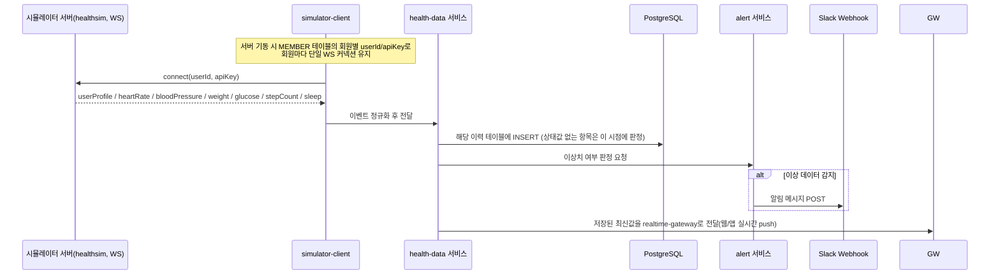
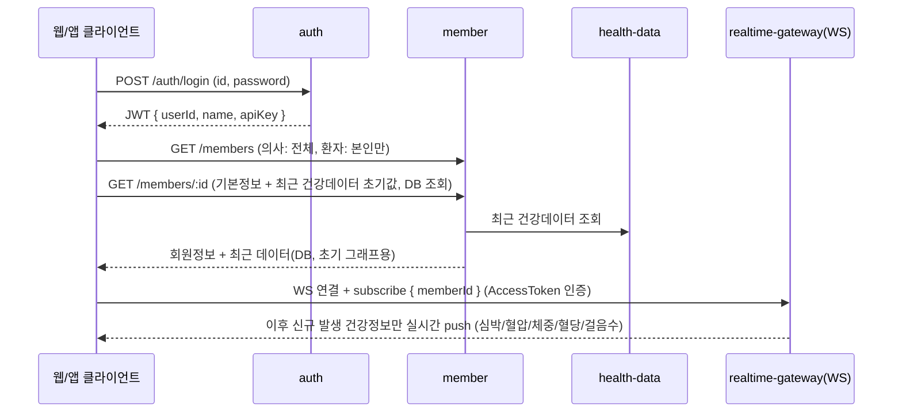
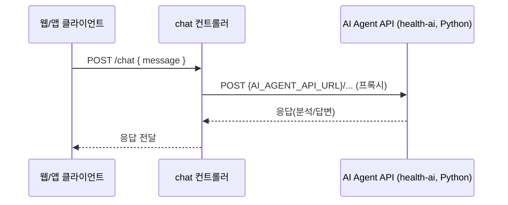

# health-backend 아키텍처

> NestJS로 구현하는 백엔드(전체 구성도의 `4-1. NestJS 백엔드`)의 내부 구조를 정의한다.
> 전체 시스템 흐름은 [../../docs/ARCHITECTURE.md](../../docs/ARCHITECTURE.md), 데이터 계약은 [../../docs/DATA_MODEL.md](../../docs/DATA_MODEL.md), 시뮬레이터 프로토콜은 [SIMULATOR_API_SPEC.md](./SIMULATOR_API_SPEC.md), 백엔드가 웹·앱에 제공하는 자체 API는 [API_SPEC.md](./API_SPEC.md)를 참고한다.

## 1. 기술 스택

| 구분 | 선택 | 비고 |
| --- | --- | --- |
| 프레임워크 | NestJS (Node.js) | REST + WebSocket 동시 제공 |
| DB | PostgreSQL | 접속정보는 `.env`로 관리 (아래 3장) |
| ORM | TypeORM | `docs/table.sql` 스키마와 1:1 매핑되는 엔티티 작성 |
| 시뮬레이터 연동 | WebSocket (Socket.IO client) | `@nestjs/websockets` + `socket.io-client`로 외부 서버(`healthsim.iranglab.com`)에 클라이언트로 접속 |
| 프론트엔드 실시간 전달 | WebSocket (Socket.IO gateway) | Nest `@WebSocketGateway`로 웹/앱에 실시간 그래프 데이터 push |
| 인증 | JWT (`@nestjs/jwt`, `passport-jwt`) | Payload: `{ userId, name, apiKey }` |
| 로깅 | winston + winston-daily-rotate-file | `./logs` 하위 날짜별 파일, 7일 보관 후 자동 삭제 |
| 알림 | Slack Incoming Webhook | `@nestjs/axios` 또는 `fetch`로 웹훅 URL에 POST |
| 스케줄러 | `@nestjs/schedule` | 오래된(7일 초과) 실시간 데이터 정리 배치 |
| 공유 코드 | `../shared` | 인터페이스/타입/공통 유틸을 backend/web/mobile이 공유 (health-ai 제외) |

## 2. 역할 (전체 구성도 기준)

전체 시스템에서 health-backend는 아래 4가지 역할을 수행한다. (`docs/ARCHITECTURE.md`의 `API-1`/`API-2`, `DATA`, `ALM`에 대응)

| 구분 | 역할 |
| --- | --- |
| **API-2** (프론트 제공) | 회원 로그인 / 회원 목록 조회 / 회원 상세 조회 REST API + 실시간 그래프용 WebSocket 제공 |
| **DATA** (데이터 수신) | 시뮬레이터 서버(WS)로부터 실시간 건강정보를 계속 수신 → DB 저장, 7일 초과 데이터 자동 삭제 |
| **API-1** (AI 연동) | 채팅 API 요청을 AI Agent API(Python, health-ai)로 프록시 |
| **ALM** (모니터링 알람) | 수신 데이터의 이상치 판정 → Slack으로 관리자 알림 |

> **원칙**: 시뮬레이터 서버와의 연결은 `simulator-client` 모듈이 전담하며, 웹/앱 클라이언트는 시뮬레이터에 직접 접속할 수 없다. 시뮬레이터에서 온 데이터는 항상 먼저 DB에 저장된 뒤, `realtime-gateway`(WebSocket)를 통해서만 클라이언트에 전달된다 — 클라이언트의 모든 통신은 health-backend를 거친다.

## 3. 환경변수 (`.env`)

설정정보는 코드에 하드코딩하지 않고 `.env`로 관리한다. (`health-backend/.env`, `.gitignore`에 이미 등록되어 커밋되지 않음)

| 변수 | 설명 | 예시 |
| --- | --- | --- |
| `PORT` | Nest 서버 포트 | `3000` |
| `DB_HOST` | PostgreSQL 호스트 | `211.253.27.76` |
| `DB_PORT` | PostgreSQL 포트 | `5432` |
| `DB_NAME` | 데이터베이스명 | `db18` |
| `DB_USER` | DB 사용자 | `user18` |
| `DB_PASSWORD` | DB 비밀번호 | (`.env` 참고) |
| `JWT_SECRET` | JWT 서명 키 | 임의 문자열 |
| `JWT_EXPIRES_IN` | JWT 만료 시간 | `1d` |
| `SIMULATOR_WS_URL` | 시뮬레이터 서버 WS 엔드포인트 | `wss://healthsim.iranglab.com/simulator` |
| `AI_AGENT_API_URL` | AI Agent API(health-ai) 베이스 URL | `http://localhost:8000` |
| `SLACK_WEBHOOK_URL` | 이상 데이터 알림용 Slack Incoming Webhook | (`.env` 참고) |
| `LOG_DIR` | winston 로그 저장 경로 | `./logs` |
| `LOG_RETENTION_DAYS` | 로그 보관 기간(일) | `7` |
| `HEALTH_DATA_RETENTION_DAYS` | 실시간 건강데이터 DB 보관 기간(일) | `7` |

> 본 프로젝트는 교육용이므로 `.env`에 실제 접속정보를 그대로 기재하고 보안 강화(비밀 관리 시스템 연동 등)는 적용하지 않는다.

## 4. 모듈 구성

```
src/
├── auth/                # 로그인, JWT 발급/검증 (JwtStrategy, AuthGuard)
├── member/              # 회원 목록/상세 조회 (MEMBER, MEMBER_DISEASE, DISEASE_CODE)
├── health-data/         # HEART_RATE/BLOOD_PRESSURE/BODY_WEIGHT/GLUCOSE/STEP_COUNT 엔티티 + 조회/저장/정리(Cron)
├── simulator-client/    # 시뮬레이터 서버(WS)에 접속하는 클라이언트, 회원별 커넥션 관리
├── realtime-gateway/    # 웹/앱에 실시간 데이터를 push하는 WebSocket 게이트웨이 (Socket.IO server)
├── alert/               # 이상 데이터 판정 + Slack 알림 발송
├── chat/                # AI Agent API 프록시 컨트롤러
├── common/              # 백엔드 내부에서만 쓰는 공통 로직 (필터, 인터셉터, winston 로거 모듈 등)
└── main.ts
```

- `MEMBER`/`DISEASE_CODE`/`MEMBER_DISEASE`, 실시간 정보 5종 테이블의 물리 스키마는 [../../docs/table.sql](../../docs/table.sql) 기준.
- Node.js 기반 프로젝트(web/mobile)와 공유 가능한 타입·인터페이스·공통 유틸(예: 이상치 판정 기준, DTO 형태)은 `health-backend`에 직접 두지 않고 `../shared`(`shared/types.ts`)에 작성 후 import한다.

## 5. 데이터 흐름

### 5.1 시뮬레이터 → 저장 → 이상 알림 (DATA + ALM)



### 5.2 프론트엔드 제공 (API-2)



- 회원 상세조회는 최초 진입 시 REST로 DB에 쌓인 가장 최근 데이터까지 내려주고, 응답 즉시 WebSocket(`realtime-gateway`)에 연결·구독해 그 이후 값만 이어받는다 (API_SPEC.md 0.1/2장).
- 클라이언트는 시뮬레이터 서버의 존재 자체를 알지 못하며, `realtime-gateway`가 유일한 실시간 데이터 통로다.
- 접근 제어: 환자(`PAT`)는 본인 데이터만, 의사(`DOC`)는 전체 회원 데이터에 접근 가능 (JWT의 `userId` + DB의 `member_type`으로 판정).

### 5.3 채팅 프록시 (API-1)



- `chat` 모듈은 인증만 검증하고 나머지는 그대로 AI Agent API에 프록시한다. 비즈니스 로직(RAG, LLM 프롬프트 등)은 health-ai가 담당.

## 6. 제공 API 개요 (API-2 / API-1)

| API | Method / Path (안) | 설명 |
| --- | --- | --- |
| 회원 로그인 | `POST /auth/login` | ID/Password 인증, JWT 발급. Payload: `{ userId, name, apiKey }` |
| 회원 목록 조회 | `GET /members` | 의사: 전체 목록 + 이름/성별 검색, 환자: 본인 정보만 |
| 회원 상세 조회 | `GET /members/:memberId` | 기본정보 + 보유질병 + 최근 건강데이터(DB) |
| 실시간 건강정보 | WS `realtime-gateway` (namespace 미정, 예: `/health`) | 회원 상세화면 진입 후 심박/혈압/체중/혈당/걸음수 실시간 push |
| 채팅(AI 프록시) | `POST /chat` | AI Agent API로 프록시 |

> 상세 요청/응답 스펙은 [API_SPEC.md](./API_SPEC.md)(백엔드가 웹·앱에 제공하는 내부 API 명세)에 정리한다. 시뮬레이터 쪽 외부 WS 명세는 [SIMULATOR_API_SPEC.md](./SIMULATOR_API_SPEC.md)를 참고.

## 7. 이상 데이터 판정 및 Slack 알림 (ALM)

`docs/DATA_MODEL.md` 기준으로 아래 항목을 저장 시점에 판정하고, 이상으로 판정되면 Slack으로 알림을 보낸다.

| 지표 | 이상 판정 기준 |
| --- | --- |
| 심박수 | 외부 이벤트의 `source: "abnormal_event"` (기준치+20bpm 이상, `MI` 보유자는 +10bpm 추가) |
| 혈압 | 외부 이벤트에 상태 필드가 없으므로 백엔드가 수축기/이완기 값 기준(예: 수축기 140↑ 또는 이완기 90↑)으로 판정 |
| 혈당 | 외부 이벤트의 `status: "high"` (140 이상) |

- 알림 메시지에는 회원ID/이름, 측정 지표, 측정값, 측정시각을 포함한다.
- Slack 발송은 `alert` 모듈에서 `SLACK_WEBHOOK_URL`로 POST하며, 과도한 알림을 막기 위한 최소 재전송 간격(디바운스)은 구현 단계에서 결정한다.

## 8. 데이터 보관 정책

- 실시간 건강정보 5종 테이블(`heart_rate`, `blood_pressure`, `body_weight`, `glucose`, `step_count`)은 `HEALTH_DATA_RETENTION_DAYS`(기본 7일)를 초과한 로우를 스케줄러(`@nestjs/schedule` Cron)로 주기적으로 삭제한다.
- `member`, `disease_code`, `member_disease`는 기제공 데이터로 삭제 대상에서 제외한다.

## 9. 로깅 정책

- winston + `winston-daily-rotate-file`을 사용해 `./logs/YYYY-MM-DD.log` 형태로 날짜별 로그 파일을 생성한다.
- `maxFiles: '7d'` 설정으로 7일이 지난 로그 파일은 자동 삭제한다.
- 시뮬레이터 연동(연결/재연결/인증 실패), API 요청, 이상 데이터 감지/Slack 알림 발송, 에러는 최소한 로그로 남긴다.

## 10. 관련 문서

| 문서 | 내용 |
| --- | --- |
| [../../docs/ARCHITECTURE.md](../../docs/ARCHITECTURE.md) | 전체 시스템 구성도 |
| [../../docs/REQUIREMENTS.md](../../docs/REQUIREMENTS.md) | 기능 요구사항 |
| [../../docs/DATA_MODEL.md](../../docs/DATA_MODEL.md) | 내부/외부 데이터 모델, 이상치 판정 기준 |
| [../../docs/table.sql](../../docs/table.sql) / [../../docs/insert.sql](../../docs/insert.sql) | PostgreSQL 테이블/초기 데이터 |
| [SIMULATOR_API_SPEC.md](./SIMULATOR_API_SPEC.md) | 시뮬레이터 서버 WS 프로토콜 (health-backend가 소비) |
| [API_SPEC.md](./API_SPEC.md) | health-backend가 웹·앱에 제공하는 내부 REST/WebSocket API |
| `../shared/types.ts` | backend/web/mobile 공유 타입 |
